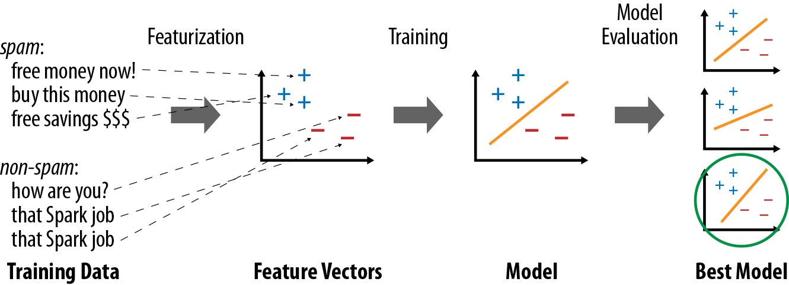

***
# Chapter 11 Machine Learning with MLlib
***

Ⓔ MLlib is Spark 's library of machine learning functions. Designed to run in parallel on clusters, MLlib contains a variety of learning algorithms and is accessible from all of Sparks programming languages. This chapter will show you how to call it in your own programs, and offer common usage tips.

Ⓒ MLlib是用于在Spark上实现机器学习函数的库。MLlib被设计成能在集群上并行运行，其中包含了大量的学习算法，并可被spark所有编程语言调用。本章将向您讲解如何在程序中调用MLlib，以及该库常见的使用方法。

Ⓔ Machine learning itself is a topic large enough to fill many books [1][footnote Some examples from O'Reilly included Machine Learning with R and Machine Learning for Hackers.], so unfortunately, in this chapter, we will not have the space to explain machine learning in detail. If you are familiar with machine learning, however, this chapter will explain how to use it in Spark; and even if you are new to it, you should be able to combine the material here with other introductory material. This chapter is most relevant to data scientists with a machine learning background looking to use Spark, as well as engineers working with a machine learning expert.

Ⓒ 机器学习本身就是一门博大精深的学科，因此很遗憾我们无法在本书中向您一一道尽机器学习。相反，如果您已经很熟悉机器学习，这章将向您阐述如何用Spark进行机器学习；但是，如果你对机器学习还很陌生，你可能需要将本章的内容结合到其它机器学习导论中理解。本章的内容面向具备机器学习背景而想使用spark的数据科学家，以及与那些与机器学习专家团队协作的数据工程师。

# Overview    ||   总览

MLlib's design and philosophy are simple: it lets you invoke various algorithms on distributed datasets, representing all data as RDDs. MLlib introduces a few data types (e.g., labeled points and vectors), but at the end of the day, it is simply a set of functions to call on RDDs. Fore example, to use MLlib for a text classification task (e.g., identifying spammy emails), you might do  the following:

1. Start with a RDD of strings representing your messages.
2. Run on of MLlib's *feture extraction* algorithms to convert text into numerical features (suitable for learning algorithms); this will give back an RDD of vectors.
3. Call a classification algorithms (e.g., Logistic regression) on the RDD of vectors; this will give back a model object that can be used to classify new points.
4. Evaluate the model on a test dataset using one of MLlib's evaluation functions.

MLib 的设计哲学很简约：用 RDD 代表所有的数据，而用户则在分布式的数据集上运行各种算法。MLib引入了几个数据类型（如，labled points和vectors），但最终，它只是简单的一组可在RDDs上调用的函数。比如，要用 MLib 去实现文本分类（识别垃圾邮件），你可能要做以下几步：

1. 从一组包含字符串信息的 RDD 开始， 用它代表你要分类的文本数据；
2. 调用 MLlib 中的一个*特征提取*算法，将文字信息转换问数字特征（因为它将很便于学习算法处理），这将返回一个包含特征向量的RDD；
3. 	基于RDD的特征向量调用一个分类算法（如逻辑回归）；它将返回一个用于识别新输入特征向量点的模型对象。
4. 	使用Mllib的某个评估函数，在一个测试数据集上评估这个模型。

One important thing to note about MLlib is that it contains only *parallel* algorithms that run well on clusters. Some classic ML algorithms are not included because they were not designed for parallel platforms, but in contrast MLlib contains several recent research algorithms for clusters, such as distributed random forests, K-means||, and alternating least squares. This choice means that MLlib is best suited for running each algorithm on a large dataset. If you instead have many small datasets on which you want to train different learning models, it would be better to use a single-node learning library (e.g., Weka or SciKit-Learn) on each node, perhaps calling it in parallel across nodes using a Spark ```map()```. Likewise, it is common for machine learning pipelines to require training the *same* algorithm on a small dataset with many configurations of parameters, in order to choose the best one. You can achieve this in Spark by using ```paralleize()``` over your list of parameters to train different ones on different nodes, again using a single-node learning library on each node. But MLlib itself shines when you have a large, distributed dataset that you need to train model on.

值得注意的是，MLib所包含的仅仅是那些能在集群上良好并行运行的算法。一些经典的机器学习算法不是为并行运算所设计的，故而没有包含在MLlib内。相反，MLlib包含了几个为集群并行计算而设计的新算法，如分布式随机森林（distributed random forests）、K均值（K-Means），和交替(??)最小二乘法（alternating least squares）。这种编排意味着MLlib是最适合于在大数据集上运行这些算法的工具。如果你有一些小数据集想要训练不同的学习模型，那么使用单节点模式的机器学习库会更好一些（如，Weka 或 SciKit-Learn ），或者使用 ```Spark map()``` 跨节点并行调用。同样的，为了找出最优的参数配置，相同的算法往往会在小数据集上先以不同参数进行训练。您可以在Spark 上用一个参数列表 list（作为输入）运行 ```parallelize()``` 去在不同的节点上训练不同参数配置，然后着在每个节点上运行单节点机器学习库。当你需要用模型训练一个大型的分布式数据集的时候，MLlib的表现将会脱颖而出。

Finally, in Spark 1.0 and 1.1, MLlib's interface is relatively low-level, giving you the functions to call for different tasks but not the higher-level workflow typically required for a learning pipeline (e.g., splitting the input into training and test data, or trying many combinations of parameters). In Spark 1.2, MLlib gains a additional (and at the time of writing still experimental) *pipeline API* for building such pipelines. This API resembles higher-level libraries like SciKit-Learn, and will hopefully make it easy to write complete, self-tuning pipelines. We include a preview of this API at the end of this chapter, but focus primarily on the lower-level APIs.

最后要说明的是，在 Spark 1.0 和 1.1 中，MLlib 的接口相对比较低级，仅给用户调用不同任务的函数，而不会有机器学习工作流程中所需的更高一级的控制（如将输入数据分离为训练和测试两组，或是测试每个组合的参数配置）。在 Spark 1.2 中MLlib提供了一个附加的（并且目前还在试验阶段的）*流程控制 API* ，用于高级的流程控制。这个 API 组件重新组合了像 SciKit-Learn 这样高级机器学习库， 从而希望简化流程控制，实现自我调优。我们本章主要探讨低级别的API，并会在本章末介绍高级别的API。

# System Requirements

MLlib requires some linear algebra libraries to be installed on your machines. First, you will need the ```fortran``` runtime library for your operating system. If MLlib warns that ```fortran``` is missing, follow the setup instructions on the MLlib website. Second, to use MLlib in Python, you will need NumPy. If your Python installation does not have it (i.e., you cannot ```import numpy```), the easiest way to get it is by installing the ```python-numpy``` or ```nunmpy``` package through your package manager on Linux, or by using a third-party scientific Python installation like Anaconda.

若要在您的计算机上运行 MLlib 的运行需要某些线性代数库的支持。首先，您的操作系统需要有```fortran```运行时库，如果MLlib警告```fortran```缺失，请按照MLlib网站提供的安装说明安装。其次，您需要 NumPy 才能在 Python 中运行 MLlib。如果您的Python安装没有包含这个库件（也就是说无法通过```import numpy```导入），最简单的方法就是通过Linux的包管理器安装```python-numpy``` 或 ```nunmpy``` 包，或者使用第三方的 Python 科研发行版，如 Anaconda。

MLlib's supported algorithms have also evolved over time. The ones we discuss here are all available as of Spark 1.2, but some of the algorithms may not be present in earlier versions.

MLlib 说支持的算法也在随着时间不断进化中，我们现在讨论的所有内容都支持 Spark 1.2， 然而有些算法可能在先前的版本中还无法使用。

# Machine Learning Basics  ||  机器学习基础

To put the functions in MLlib in context, we’ll start with a brief review of machine learning concepts.

我们首先简要回顾一下机器学习的基本概念，然后看看如何在 MLlib 环境中实现这些功能。

Machine learning algorithms attempt to make predictions or decisions based on training data, often maximizing a mathematical objective about how the algorithm should behave. There are multiple types of learning problems, including classification, regression, or clustering, which have different objectives. As a simple example, we’ll consider classification, which involves identifying which of several categories an item belongs to (e.g., whether an email is spam or non-spam), based on labeled examples of other items (e.g., emails known to be spam or not).

机器学习算法是一些基于训练数据试图去预测或做决策的算法，通常情况它们的实质是最大化一个数学语言描述的目标函数，它描述了算法该如何去预测或判断。 机器学习要出处理的问题有很多类，包括了分类、回归、聚类等，它们各自有着不同的目标函数。以分类这个简单例子来说，它就是要利用一些带有标签的样本或是物件（例如一些已知是否是垃圾的邮件）找出一个物件在某几个类中属于哪个类（如去判断一个新邮件是否是垃圾邮件）。

All learning algorithms require defining a set of features for each item, which will be fed into the learning function. For example, for an email, some features might include the server it comes from, or the number of mentions of the word free, or the color of the text. In many cases, defining the right features is the most challenging part of using machine learning. For example, in a product recommendation task, simply adding another feature (e.g., realizing that which book you should recommend to a user might also depend on which movies she’s watched) could give a large improvement in results.

所有的学习算法都需要为每个物件（对象）定义一些特征，用这些特征输入到学习函数中去。以一个邮件为例，这些特征包含了：发送服务器、“免费”出现的频率、文本的颜色等。大多数情况下，正确的定义特征是机器学习中具有挑战性的工作。例如，在产品推荐学习中加入一个新特征（例如，根据用户喜欢的电影来判断想他推荐什么相关的书籍）就会在结果上得到很大的提升。

Most algorithms are defined only for numerical features (specifically, a vector of numbers representing the value for each feature), so often an important step is feature extraction and transformation to produce these feature vectors. For example, for text classification (e.g., our spam versus non-spam case), there are several methods to featurize text, such as counting the frequency of each word.

大多数算法的运行为数值特征（特别是一组数值向量代表了描述每个特征的量化值）而设计，因此特征的提取和特征向量的转化也是机器学习的重要一步。例如，（垃圾邮件的识别）文本分类中，文本特征化的方法有很多种，比如词频统计。

Once data is represented as feature vectors, most machine learning algorithms optimize a well-defined mathematical function based on these vectors. For example, one classification algorithm might be to define the plane (in the space of feature vectors) that “best” separates the spam versus non-spam examples, according to some definition of “best” (e.g., the most points classified correctly by the plane). At the end, the algorithm will return a model representing the learning decision (e.g., the plane chosen). This model can now be used to make predictions on new points (e.g., see which side of the plane the feature vector for a new email falls on, in order to decide whether it’s spam). Figure 11-1 shows an example learning pipeline.

一旦拥有特征向量可以描述数据，大多数机器学习算法开始基于这些向量优化一个数学函数（目标函数）。例如，某个分类算法可能试着根据已定义好的“最优”样本去定义一个“超面”用来“最优”的划分垃圾和非垃圾样本。 最终算法会反馈一个代表学习到的策略（例如如何找到这个“超面”）的模型。这个模型可被用于预测输入的新特征向量点（例如，判断一个新邮件落于超面的哪一边，从而决定它是否是垃圾邮件）。图 11-1 展示了这个学习建模的过程。


*Figure 11-1. Typical steps in a machine learning pipeline *
*图 11-1 一个机器学习流程的典型过程*

Finally, most learning algorithms have multiple parameters that can affect results, so real-world pipelines will train multiple versions of a model and evaluate each one. To do this, it is common to separate the input data into “training” and “test” sets, and train only on the former, so that the test set can be used to see whether the model overfit the training data. MLlib provides several algorithms for model evaluation.

最终，大多数学习算法拥有很多参数会影响到最终结果， 因此，真正的建模学习过程会训练并评估多个版本的模型。为此，通常会把输入的数据分为“训练数据”和“测试数据”，并只用前者进行模型训练，用测试数据去验证模型是否过于拟合训练数据。MLlib提供多种算法进行模型验证。

## Example: Spam Classification  |  案例：垃圾邮件分类

As a quick example of MLlib, we show a very simple program for building a spam classifier (Examples 11-1 through 11-3). This program uses two MLlib algorithms: HashingTF, which builds term frequency feature vectors from text data, and Logistic RegressionWithSGD, which implements the logistic regression procedure using stochastic gradient descent (SGD). We assume that we start with two files, spam.txt and normal.txt, each of which contains examples of spam and non-spam emails, one per line. We then turn the text in each file into a feature vector with TF, and train a logistic regression model to separate the two types of messages. The code and data files are available in the book’s Git repository.

我们在此展示一个简单的程序实现垃圾分类作为MLlib的简单案例 (示例 11-1 至 11-3)。 这个程序使用了MLlib的两个算法：（1）HashingTF，用于从文本数据建立特征向量的词频；（2）RegressionWithSGD，基于随机梯度下降法（SGD）实现逻辑回归。我们假设手头有两个文件，spam.txt 和 normal.txt，各自包含了垃圾邮件和非垃圾邮件的文本样本，每行一个词条。我们使用TF将每个文本文件转换为特征向量，并训练一个逻辑回归模型用于区分两种不同的信息。这个程序的代码和数据可以在本书的Git版本库中找到。

*Example 11-1. Spam classifier in Python*

```
from pyspark.mllib.regression import LabeledPoint
from pyspark.mllib.feature import HashingTF
from pyspark.mllib.classification import LogisticRegressionWithSGD

spam = sc.textFile("spam.txt")
normal = sc.textFile("normal.txt")

# Create a HashingTF instance to map email text to vectors of 10,000 features.
tf = HashingTF(numFeatures = 10000)
# Each email is split into words, and each word is mapped to one feature. spamFeatures = spam.map(lambda email: tf.transform(email.split(" "))) normalFeatures = normal.map(lambda email: tf.transform(email.split(" ")))

# Create LabeledPoint datasets for positive (spam) and negative (normal) examples.
positiveExamples = spamFeatures.map(lambda features: LabeledPoint(1, features)) negativeExamples = normalFeatures.map(lambda features: LabeledPoint(0, features)) trainingData = positiveExamples.union(negativeExamples)
trainingData.cache() # Cache since Logistic Regression is an iterative algorithm.
# Run Logistic Regression using the SGD algorithm.
model = LogisticRegressionWithSGD.train(trainingData)
# Test on a positive example (spam) and a negative one (normal). We first apply
# the same HashingTF feature transformation to get vectors, then apply the model. posTest = tf.transform("O M G GET cheap stuff by sending money to ...".split(" ")) negTest = tf.transform("Hi Dad, I started studying Spark the other ...".split(" ")) print "Prediction for positive test example: %g" % model.predict(posTest)
print "Prediction for negative test example: %g" % model.predict(negTest)
``` 
*Example 11-2 Spam classier in Scala*
```
import org.apache.spark.mllib.regression.LabeledPoint
import org.apache.spark.mllib.feature.HashingTF
import org.apache.spark.mllib.classification.LogisticRegressionWithSGD

val spam = sc.textFile("spam.txt") 
val normal = sc.textFile("normal.txt")

// Create a HashingTF instance to map email text to vectors of 10,000 features.
val tf = new HashingTF(numFeatures = 10000)
// Each email is split into words, and each word is mapped to one feature. val spamFeatures = spam.map(email => tf.transform(email.split(" ")))
val normalFeatures = normal.map(email => tf.transform(email.split(" ")))

// Create LabeledPoint datasets for positive (spam) and negative (normal) examples.
val positiveExamples = spamFeatures.map(features => LabeledPoint(1, features)) 
val negativeExamples = normalFeatures.map(features => LabeledPoint(0, features)) val trainingData = positiveExamples.union(negativeExamples)
trainingData.cache() // Cache since Logistic Regression is an iterative algorithm.

// Run Logistic Regression using the SGD algorithm.
val model = new LogisticRegressionWithSGD().run(trainingData)

// Test on a positive example (spam) and a negative one (normal).
val posTest = tf.transform(
"O M G GET cheap stuff by sending money to ...".split(" "))
val negTest = tf.transform(
"Hi Dad, I started studying Spark the other ...".split(" "))
println("Prediction for positive test example: " + model.predict(posTest))
println("Prediction for negative test example: " + model.predict(negTest))
```

*Example 11-3 Spam classifier in Java *

As you can see, the code is fairly similar in all the languages. It operates directly on RDDs—in this case, of strings (the original text) and ```LabeledPoints``` (an MLlib data type for a vector of features together with a label).

可以看出，各种语言的代码是极其相似的。它们都是直接操作RDD---在这个案例中就是（最原始的）字符串和```LabeledPoints```（一种MLlib中表示特征向量与对应标签集合的数据类型）。

# Data Types  |  数据类型

MLlib contains a few specific data types, located in the org.apache.spark.mllib package (Java/Scala) or pyspark.mllib (Python). The main ones are:


```Vector```
> A mathematical vector. MLlib supports both dense vectors, where every entry is stored, and sparse vectors, where only the nonzero entries are stored to save space. We will discuss the different types of vectors shortly. Vectors can be con‐ structed with the mllib.linalg.Vectors class.

```LabeledPoint```
> A labeled data point for supervised learning algorithms such as classification and regression. Includes a feature vector and a label (which is a floating-point value). Located in the mllib.regression package.


```Rating```
> A rating of a product by a user, used in the ```mllib.recommendation``` package for product recommendation.

*Various* ```Model``` *classes*
> Each ```Model``` is the result of a training algorithm, and typically has a ```predict()``` method for applying the model to a new data point or to an RDD of new data points.

Most algorithms work directly on RDDs of Vectors, LabeledPoints, or Ratings. You can construct these objects however you want, but typically you will build an RDD through transformations on external data—for example, by loading a text file or run‐ ning a Spark SQL command—and then apply a map() to turn your data objects into MLlib types.

## Working with Vectors  |  使用向量

There are a few points to note for the ```Vector``` class in MLlib, which will be the most commonly used one.

***

########
#  I， Seika， input this chapter to here 
########


