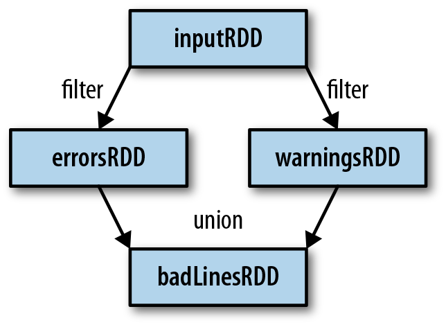
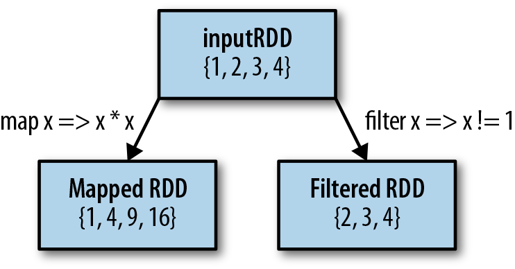
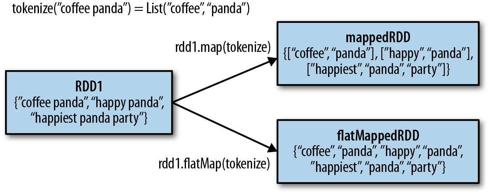
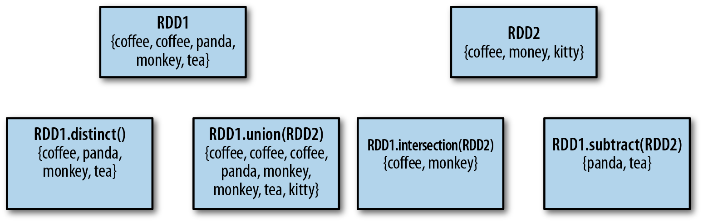
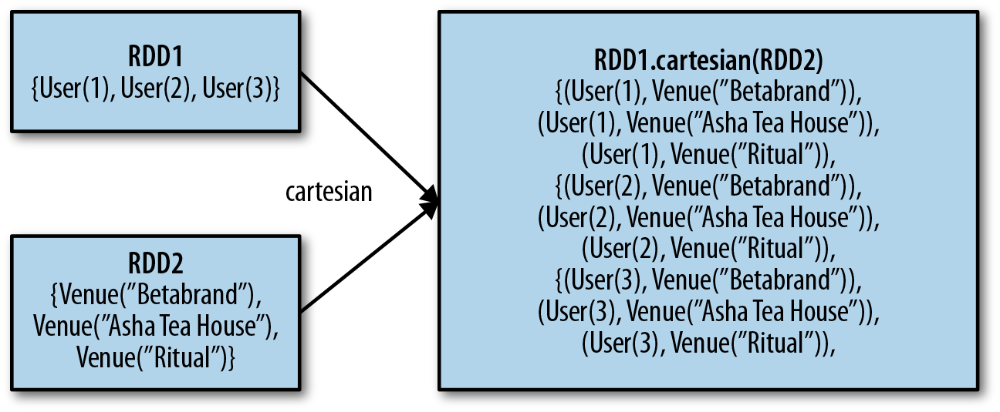

***
# 第三章 Programming with RDDs   ||   RDD  编程
***

Ⓔ This chapter introduces Spark’s core abstraction for working with data, the resilient distributed dataset (RDD). An RDD is simply a distributed collection of elements. In Spark all work is expressed as either creating new RDDs, transforming existing RDDs, or calling operations on RDDs to compute a result. Under the hood, Spark automatically distributes the data contained in RDDs across your cluster and parallelizes the operations you perform on them.

Ⓒ 本章介绍 Spark 处理数据的核心抽象：弹性分布式数据集(resilient distributed dataset, RDD)。简单来说 RDD 就是元素的分布式集合。在 Spark 中，所有的任务都可以被表达为创建新 RDD、对已有 RDD 进行变换、或者对 RDD 调用某些操作从而计算出一个结果。在这行为底层，Spark 将包含在 RDD 中的数据自动分布到整个集群，对集群并行化你要执行的操作。

ⒺBoth data scientists and engineers should read this chapter, as RDDs are the core concept in Spark. We highly recommend that you try some of these examples in an interactive shell (see “Introduction to Spark’s Python and Scala Shells” on page 11). In addition, all code in this chapter is available in the book’s GitHub repository.

Ⓒ 数据科学家和工程师都应该阅读本章，因为 RDD 是 Spark 的核心概念。我们强烈建议你在交互式 Shell 中尝试一些示例（见本书第 11 页的“Spark 的 Python 和 Scala Shell 简介”）。另外，本章所有的代码都在本书的 github 库有下载。

# RDD Basics   ||   RDD  基础

Ⓔ An RDD in Spark is simply an immutable distributed collection of objects. Each RDD is split into multiple partitions, which may be computed on different nodes of the cluster. RDDs can contain any type of Python, Java, or Scala objects, including user-defined classes.

Ⓒ 简单的说 Spark 中的 RDD 就是所有对象的一个不可变的分布式集合。每个 RDD 都被分割为多个分区，这就可以在集群的不同节点上进行计算。RDD 可以包含任何 Python，Java，Scala 对象类型，包括用户自定义类型。

Ⓔ Users create RDDs in two ways: by loading an external dataset, or by distributing a collection of objects (e.g., a list or set) in their driver program. We have already seen loading a text file as an RDD of strings using ```SparkContext.textFile()``` , as shown in *Example 3-1* .

Ⓒ 用户可以通过两种方式创建 RDD：加载一个外部数据集，或者在驱动程序中分发一个对象集合（如 list 或 set）。如同 *示例3-1* 展示的，我们知道了使用 ```SparkContext.textFile()``` 函数加载一个文本文件作为一个字符串 RDD。

*Example 3-1. Creating an RDD of strings with* ```textFile()``` *in Python*
*示例 3-1 ：在 Python 中用* ```textFile()``` *函数创建一个字符串 RDD*
```
>>> lines = sc.textFile("README.md")
```

Ⓔ Once created, RDDs offer two types of operations: transformations and actions. Transformations construct a new RDD from a previous one. For example, one common transformation is filtering data that matches a predicate. In our text file example, we can use this to create a new RDD holding just the strings that contain the word Python, as shown in Example 3-2.

Ⓒ RDD 一旦创建好了，可以提供两种不同类型的操作：*变换操作*(transformation)和*行动操作*(action)。变换操作是从前一个 RDD 构造出一个新的 RDD。例如，有一个常见的变换是用谓词匹配来过滤数据。在我们之前的文本文件的示例中，我们可以用这个变换来创建一个新的 RDD，这个 RDD 容纳的数据是只包含了单词“Python”的字符串。如示例 3-2 所示：

*Example 3-2. Calling the filter() transformation*
示例 3-2 ：调用 ```filter()``` 变换
```
>>> pythonLines = lines.filter(lambda line: "Python" in line)
```

Ⓔ Actions, on the other hand, compute a result based on an RDD, and either return it to the driver program or save it to an external storage system (e.g., HDFS). One example of an action we called earlier is ```first()```, which returns the first element in an RDD and is demonstrated in *Example 3-3*.

Ⓒ 相反，行动操作是基于 RDD 来计算某个结果，并将结果返回给驱动程序或者保存结果到一个外部的存储系统（如 HDFS）。早前我们调用过一个动作的例子是 ```first()```。它返回 RDD 中的第一个元素，*示例 3-3* 展示了这点：

*Example 3-3. Calling the ```first()``` action*
*示例 3-3 ：调用 ```first()``` 动作*
```
>>> pythonLines.first()
u'## Interactive Python Shell'
```

ⒺTransformations and actions are different because of the way Spark computes RDDs. Although you can define new RDDs any time, Spark computes them only in a lazy fashion—that is, the first time they are used in an action. This approach might seem unusual at first, but makes a lot of sense when you are working with Big Data. For instance, consider Example 3-2 and Example 3-3, where we defined a text file and then filtered the lines that include Python. If Spark were to load and store all the lines in the file as soon as we wrote ```lines = sc.textFile(...)```, it would waste a lot of storage space, given that we then immediately filter out many lines. Instead, once Spark sees the whole chain of transformations, it can compute just the data needed for its result. In fact, for the ```first() action``` , Spark scans the file only until it finds the first matching line; it doesn’t even read the whole file.

Ⓒ 变换和动作的区别源于 Spark 对 RDD 的不同计算方式。尽管任何时候你都可以定义一个新的 RDD，但是 Spark 总是以一种惰性(lazy)的方式计算它们，也就是它们被第一次用于动作的时候。刚开始接触到这种方式可能觉得不太寻常，但是当您开始处理大数据时就会有感觉了。举例来说，考虑下前面的*示例 3-2* 和*示例 3-3*，我们定义了一个文本文件 RDD 然后过滤出包含“Python”字符的行。如果当我们一写完 ```lines = sc.textFile(...)``` 语句，Spark 就立刻加载和保存整个文件的所有行的话，考虑到我们马上就要过虑掉很多的行，这会导致浪费很多存储空间。反过来说，一旦Spark知道了整个变换链，它就能只计算结果需要的数据。实际上，对于 ```first()``` 动作来说，Spark 只需要扫描文件直到它找到第一个符合条件的行就可以了，这甚至不需要读整个文件。

##################################
########    I ```Seika``` have revised to here #######
##################################

Ⓔ Finally, Spark’s RDDs are by default recomputed each time you run an action on them. If you would like to reuse an RDD in multiple actions, you can ask Spark to persist it using  RDD.persist() . We can ask Spark to persist our data in a number of different places, which will be covered in Table 3-6. After computing it the first time, Spark will store the RDD contents in memory (partitioned across the machines in your cluster), and reuse them in future actions. Persisting RDDs on disk instead of memory is also possible. The behavior of not persisting by default may again seem unusual, but it makes a lot of sense for big datasets: if you will not reuse the RDD, there’s no reason to waste storage space when Spark could instead stream through the data once and just compute the result. {footnote:The ability to always recompute an RDD is actually why RDDs are called “resilient.” When a machine holding RDD data fails, Spark uses this ability to recompute the missing partitions, transparent to the user.}

Ⓒ 最后，每次你执行个动作，Spark 的 RDD 默认会被重新计算。如果你想在多个动作中重用 RDD，你可以用 RDD.persist()要求 Spark 对 RDD 持久化。我们可以用一些不同的方式要求 Spark 对我们的数据持久化，详见表 3-6。在初次计算之后，Spark 可以保存 RDD 的内容到内存中（在你的集群中跨机器分区），并在未来的动作中重用。持久化 RDD 到磁盘上，而不是内存中，也是可能的。默认不持久化的行为看起来也有点奇怪，但是对大数据集来说就该这样：如果你不会重用这个 RDD，那就没有理由浪费存储空间。相反的，一旦 Spark 流过数据，只是计算结果就好了。 {脚注：总是重新计算一个 RDD 的能力事实上就是为什么 RDD 被称为“弹性”的原因。当拥有 RDD 数据的机器发生故障，Spark 就利用这个能力重新计算丢失的分区，这对用户来说是透明的。}

Ⓔ In practice, you will often use  persist() to load a subset of your data into memory and query it repeatedly. For example, if we knew that we wanted to compute multiple results about the README lines that contain Python, we could write the script shown in Example 3-4.

Ⓒ 实际上，你会经常使用 persist()来加载你的数据子集到内存并反复查询。比如，如果我们知道我们想要计算关于 README 文件中包含“Python”的行的多个结果，我们会写示例 3-4 那样的脚本。

*Example 3-4. Persisting an RDD in memory*
*示例 3-4 ：持久化 RDD 到内存*
```
>>> pythonLines.persist
>>> pythonLines.count()
2
>>> pythonLines.first()
u'## Interactive Python Shell'
```
Ⓔ To summarize, every Spark program and shell session will work as follows:
1. Create some input RDDs from external data.
2. Transform them to define new RDDs using transformations like  filter() .
3. Ask Spark to  persist() any intermediate RDDs that will need to be reused.
4. Launch actions such as  count() and  first() to kick off a parallel computation,
which is then optimized and executed by Spark.

Ⓒ 总之，每个 Spark 程序或者 shell 会话都是像这样工作：
1. 从外部数据创建一些作为输入的 RDD；
2. 使用类似 ```filter()``` 之类的变换来定义出新的 RDD‘
3. 要求 Spark 对需要重用的任何中间 RDD 进行 ```persist()```；
4. 启动类似 ```count()``` 和 ```first()``` 的动作开始并行计算，然后 Spark 会优化并执行。

> Ⓔ ```cache()``` is the same as calling ```persist()``` with the default storage level.
> Ⓒ ```cache()``` 和在默认存储级别上和调用 ```persist()``` 的效果一样。

Ⓔ In the rest of this chapter, we’ll go through each of these steps in detail, and cover some of the most common RDD operations in Spark.

Ⓒ 在本章接下来的部分，我们将从头到尾的详细讨论每个步骤，包括 Spark 中一些最常用的操作。

# Creating RDDs   ||   创建 RDD

Ⓔ Spark provides two ways to create RDDs: loading an external dataset and parallelizing a collection in your driver program.

Ⓒ Spark 提供两种方式创建 RDD：加载一个外部数据集，或者在你的驱动程序中并行化一个数据集合。

Ⓔ The simplest way to create RDDs is to take an existing collection in your program and pass it to SparkContext’s  parallelize() method, as shown in Examples 3-5 through 3-7. This approach is very useful when you are learning Spark, since you can quickly create your own RDDs in the shell and perform operations on them. Keep in mind, however, that outside of prototyping and testing, this is not widely used since it requires that you have your entire dataset in memory on one machine.

Ⓒ 最简单的创建 RDD 的方式就是将你程序中已存在的集合传递给 SparkContext 的 ```parallelize()``` 方法，见*示例 3-5* 到 *3-7*。当你在学习 Spark 的时候，这种方法非常有用。你可以在 Shell 中快速创建你自己的 RDD 并对其进行操作。请记住，在创建原型和测试之外，这种方式并不常用，因为它会要求所整个数据集都在一台机器上的内存中。

Example 3-5. ```parallelize()``` method in Python
示例 3-5 ： Python 的 parallelize() 方法
```
lines = sc.parallelize(["pandas", "i like pandas"])
```

Example 3-6. ```parallelize()``` method in Scala
示例 3-6 ： Scala 的 parallelize() 方法
```
val lines = sc.parallelize(List("pandas", "i like pandas"))
```

Example 3-7. ```parallelize()``` method in Java
示例 3-7 ： Java 的 parallelize() 方法
```
JavaRDD<String> lines = sc.parallelize(Arrays.asList("pandas", "i like pandas"));
```

Ⓔ A more common way to create RDDs is to load data from external storage. Loading external datasets is covered in detail in Chapter 5. However, we already saw one method that loads a text file as an RDD of strings,  SparkContext.textFile() , which is shown in Examples 3-8 through 3-10.

Ⓒ 更常见的方式是从外部存储加载数据，详见第 5 章。然而我们之前已经见过加载
文本文件为字符串 RDD 的方法:SparkContext.textFile()，见示例 3-8 到 3-10。

Example 3-8. textFile() method in Python
示例 3-8 ： Python 的 textFile() 方法
```
lines = sc.textFile("/path/to/README.md")
```

Example 3-9. textFile() method in Scala
示例 3-9 ： Scala 的 textFile() 方法
```
val lines = sc.textFile("/path/to/README.md")
```

Example 3-10. textFile() method in Java
示例 3-10 ： Java 的 textFile() 方法
```
JavaRDD<String> lines = sc.textFile("/path/to/README.md");
```

# RDD Operations   ||   RDD 操作

Ⓔ As we’ve discussed, RDDs support two types of operations: transformations and actions. Transformations are operations on RDDs that return a new RDD, such as map() and  filter() . Actions are operations that return a result to the driver program or write it to storage, and kick off a computation, such as  count() and  first() . Spark treats transformations and actions very differently, so understanding which type of operation you are performing will be important. If you are ever confused whether a given function is a transformation or an action, you can look at its return type: transformations return RDDs, whereas actions return some other data type.

Ⓒ 我们已经提到过，RDD 支持两种类型的操作：变换和动作。变换是对一个 RDD 进行操作得到一个新的 RDD，如 map()和 filter()。动作是返回一个结果到驱动程序或者写入到存储并开始计算的操作，如 count()和 first()。Spark 对待变换和动作很不一样，所以理解你要执行的是何种操作十分重要。如果你对一个给定的函数是变换还是动作还有些混淆，那就看它的返回类型。返回 RDD 的就是变换，反之，动作是返回其他类型。

## Transformations   ||   变换

ⒺTransformations are operations on RDDs that return a new RDD. As discussed in “Lazy Evaluation” on page 29, transformed RDDs are computed lazily, only when you use them in an action. Many transformations are element-wise; that is, they work on one element at a time; but this is not true for all transformations.

Ⓒ 变换是对一个 RDD 进行操作得到一个新的 RDD。如 29 的“延迟计算”中讨论的一样，RDD 的变换计算是会延迟的，直到你在一个动作中用到。大多数变换都是元素级的，也就是说，每次处理一个元素，但不是所有变换都这样。

Ⓔ As an example, suppose that we have a logfile, log.txt, with a number of messages, and we want to select only the error messages. We can use the  filter() transformation seen before. This time, though, we’ll show a filter in all three of Spark’s language APIs (Examples 3-11 through 3-13).

Ⓒ 看个例子。假设我们有个日志文件 log.txt，里面有些日志消息。我们想仅选择出错误消息。可以用之前见过的 filter()变换。这次我们用 Spark 的所有三种语言API 来展示 filter 的用法（见示例 3-11 到 3-13）。

*Example 3-11. filter() transformation in Python*
```
inputRDD = sc.textFile("log.txt")
errorsRDD = inputRDD.filter(lambda x: "error" in x)
```
*Example 3-12. filter() transformation in Scala*
```
val inputRDD = sc.textFile("log.txt")
val errorsRDD = inputRDD.filter(line => line.contains("error"))
```
*Example 3-13. filter() transformation in Java*
```
JavaRDD<String> inputRDD = sc.textFile("log.txt");
JavaRDD<String> errorsRDD = inputRDD.filter(
  new Function<String, Boolean>() {
    public Boolean call(String x) { return x.contains("error"); }
  }
});
```

Ⓔ Note that the  filter() operation does not mutate the existing  inputRDD . Instead, it returns a pointer to an entirely new RDD.  inputRDD can still be reused later in the program—for instance, to search for other words. In fact, let’s use  inputRDD again to search for lines with the word warning in them. Then, we’ll use another transformation,  union() , to print out the number of lines that contained either error or warning. We show Python in Example 3-14, but the  union() function is identical in all three languages.

Ⓒ 注意这里的 ```filter()``` 操作并没改变已存在的 ```inputRDD```，相反，它返回了整个新 RDD 的指针。InputRDD 仍然可以在后面的程序中重用－比如要查找别的词。实际上，让我们再来用这个 RDD 找包含词语”warning”的行。然后我们用另一个变换 union 来打印这些包含了”error”或者”warning”的行。在示例 3-14 中我们是用 Python 展示，但是 union 在所有的三种语言中都支持。

*Example 3-14. union() transformation in Python*
```
errorsRDD = inputRDD.filter(lambda x: "error" in x)
warningsRDD = inputRDD.filter(lambda x: "warning" in x)
badLinesRDD = errorsRDD.union(warningsRDD)
```

Ⓔ union() is a bit different than  filter() , in that it operates on two RDDs instead of
one. Transformations can actually operate on any number of input RDDs.

Ⓒ union 和 filter 变换有一点点不同，它是对两个 RDD 操作，而不是一个。实际上
变换可以对任意个输入 RDD 进行操作。

> Ⓔ A better way to accomplish the same result as in Example 3-14
would be to simply filter the  inputRDD once, looking for either
error or warning.

> Ⓒ 达到示例 3-14 同样结果的更好的方式是只过滤 inputRDD 一次，查找”error”或
者”warning”。

Ⓔ Finally, as you derive new RDDs from each other using transformations, Spark keeps track of the set of dependencies between different RDDs, called the lineage graph. It uses this information to compute each RDD on demand and to recover lost data if part of a persistent RDD is lost. Figure 3-1 shows a lineage graph for Example 3-14.

Ⓒ 最终，从 RDD 的相互变换形成了新的 RDD，Spark 跟踪了这些不同 RDD 之间的依赖关系的集合，称之为血统图(lineage graph)。Spark 用这个信息来根据需要计算每个 RDD，并恢复丢失的数据，如果持久化的 RDD 的一部分丢失了的话。图 3-1 展示了示例 3-14 的血统图。


*Figure 3-1. RDD lineage graph created during log analysis*
*图 3-1. 日志分析中创建的 RDD 血统图*

## Actions

Ⓔ We’ve seen how to create RDDs from each other with transformations, but at some point, we’ll want to actually *do something* with our dataset. Actions are the second type of RDD operation. They are the operations that return a final value to the driver program or write data to an external storage system. Actions force the evaluation of the transformations required for the RDD they were called on, since they need to actually produce output.

Ⓒ 我们已经知道如何从各种变化创建 RDD，但有时候我们想实际对数据*做点什么*。动作是第二种操作。它们是返回一个最终值给驱动程序或者写入外部存储系统的操作。动作迫使对调用的 RDD 的变换请求进行求值，因为需要实际产生输出。

Ⓔ Continuing the log example from the previous section, we might want to print out some information about the ```badLinesRDD``` . To do that, we’ll use two actions, ```count()``` , which returns the count as a number, and ```take()``` , which collects a number of elements from the RDD, as shown in *Examples 3-15* through *3-17*.

Ⓒ 继续前一章的日志的例子，我们想打印一些关于 ```badlinesRDD``` 的信息。为此，我们将使用 ```count()``` 和 ```take()``` 两个动作。```count()```将返回其中的记录数，而 ```take()```返回RDD 中的一些元素，见例子 *3-15* 至 *3-17*。

*Example 3-15. Python error count using actions*
```
print "Input had " + badLinesRDD.count() + " concerning lines"
print "Here are 10 examples:"
for line in badLinesRDD.take(10):
print line
```

*Example 3-16. Scala error count using actions*
```
println("Input had " + badLinesRDD.count() + " concerning lines")
println("Here are 10 examples:")
badLinesRDD.take(10).foreach(println)
```

*Example 3-17. Java error count using actions*
```
System.out.println("Input had " + badLinesRDD.count() + " concerning lines")
System.out.println("Here are 10 examples:")
for (String line: badLinesRDD.take(10)) {
  System.out.println(line);
}
```

Ⓔ In this example, we used  take() to retrieve a small number of elements in the RDD
at the driver program. We then iterate over them locally to print out information at
the driver. RDDs also have a  collect() function to retrieve the entire RDD. This can
be useful if your program filters RDDs down to a very small size and you’d like to
deal with it locally. Keep in mind that your entire dataset must fit in memory on a
single machine to use  collect() on it, so  collect() shouldn’t be used on large
datasets.

Ⓒ 本例中，我们在驱动程序中用 take()来获取 RDD 中少量的元素，然后在本地遍
历这些元素并打印出来。RDD 也有 collect()函数可以获取所有的元素。如果你的
程序将 RDD 过滤到一个比较小的数据集并且想要在本地处理时，collect()会有
用。记住，你使用 collec()的话整个数据集必须适合单机的内存大小，所以 collect()
不适合对大数据集使用。

Ⓔ In most cases RDDs can’t just be  collect() ed to the driver because they are too
large. In these cases, it’s common to write data out to a distributed storage system
such as HDFS or Amazon S3. You can save the contents of an RDD using the
saveAsTextFile() action,  saveAsSequenceFile() , or any of a number of actions for
various built-in formats. We will cover the different options for exporting data in
Chapter 5.

Ⓒ 大多数情况下，RDD 都不能 collect()到驱动程序，因为 RDD 一般都太大。这样
的话，通常是将所有数据输出到分布式存储系统中，如 HDFS 或 S3 等。你可以
用 saveAsTextFile()，saveAsSequenceFile()或者任何其他各种内置格式的动作来保
存 RDD 的内容。我们会在第五章讨论数据输出的不同选择。

Ⓔ It is important to note that each time we call a new action, the entire RDD must be
computed “from scratch.” To avoid this inefficiency, users can persist intermediate
results, as we will cover in “Persistence (Caching)” on page 44.

Ⓒ 值得注意的是，每次我们调用一个新动作，整个 RDD 都必须“从头开始”计算。
要避免低效，用户可以像 44 页提到的“持久化（缓存）”那样持久化中间结果。

## Lazy Evaluation   |||   ？？评估

Ⓔ As you read earlier, transformations on RDDs are lazily evaluated, meaning that Spark will not begin to execute until it sees an action. This can be somewhat counter intuitive for new users, but may be familiar for those who have used functional languages such as Haskell or LINQ-like data processing frameworks.

Ⓒ 如前所述，RDD 的变换是延迟求值，这意味着 Spark 直到看到一个动作才会进行求值。这对新用户来说可能有点反直觉，而使用过函数语言如 Haskell 或 LINQ-like 之类数据处理框架的用户会熟悉一些

Ⓔ Lazy evaluation means that when we call a transformation on an RDD (for instance, calling  map() ), the operation is not immediately performed. Instead, Spark internally records metadata to indicate that this operation has been requested. Rather than thinking of an RDD as containing specific data, it is best to think of each RDD as consisting of instructions on how to compute the data that we build up through transformations. Loading data into an RDD is lazily evaluated in the same way transformations are. So, when we call  sc.textFile() , the data is not loaded until it is necessary. As with transformations, the operation (in this case, reading the data) can occur multiple times.

Ⓒ 延迟求值表示当我们对 RDD 调用变换时（比如 ```map()```)，该操作不会立即执行。相反的，Spark 内部记录元数据来指明该操作被请求。与其认为 RDD 包含了特殊的数据，不如认识 RDD 是由累积的数据变换如何计算的指令组成。加载数据到 RDD 也是一样的。所以我们调用 ```sc.textFile()``` 的时候数据直到有必要时才实际加载。如同变换一样，该操作(在这是指读取数据)可以发生多次。

# Passing Functions to Spark

Ⓔ Most of Spark’s transformations, and some of its actions, depend on passing in functions that are used by Spark to compute data. Each of the core languages has a slightly different mechanism for passing functions to Spark.

Ⓒ 大多数的 Spark 的变换和一些动作都依赖于向 Spark 传入函数，这些函数被 Spark 用于计算数据。各个语言对于传递参数到 Spark 的机制有些细微的差异。

## Python

Ⓔ In Python, we have three options for passing functions into Spark. For shorter functions, we can pass in lambda expressions, as we did in Example 3-2, and as Example 3-18 demonstrates. Alternatively, we can pass in top-level functions, or locally defined functions.

Ⓒ 在 Python 中，传递函数到 Spark 有三种方式。对于较短的函数，可以通过 lambda 表达式来传递，见示例 3-2 和 3-18 所示。或者，也可以用顶级函数或者局部定义的函数。

*Example 3-18. Passing functions in Python*
```
word = rdd.filter(lambda s: "error" in s)
def containsError(s):
    return "error" in s
word = rdd.filter(containsError)
```

Ⓔ One issue to watch out for when passing functions is inadvertently serializing the object containing the function. When you pass a function that is the member of an object, or contains references to fields in an object (e.g.,  self.field ), Spark sends the entire object to worker nodes, which can be much larger than the bit of information you need (see Example 3-19). Sometimes this can also cause your program to fail, if your class contains objects that Python can’t figure out how to pickle.

Ⓒ 当传递函数时，该函数包含要序列化的对象，那么有个问题要注意。当你传递的函数是一个对象的成员，或者包含了一个对象的字段的引用（比如 self.field），Spark 是发送整个对象到 worker 节点。这可能会比你需要的信息多得多（见示例3-19）。有时候这会导致你的程序出错，当你的类中包含了 python 不知道如何pickle 的对象的话。

*Example 3-19. Passing a function with field references (don’t do this!)*
```
class SearchFunctions(object):
def __init__(self, query):
self.query = query
def isMatch(self, s):
return self.query in s
def getMatchesFunctionReference(self, rdd):
# Problem: references all of "self" in "self.isMatch"
return rdd.filter(self.isMatch)
def getMatchesMemberReference(self, rdd):
# Problem: references all of "self" in "self.query"
return rdd.filter(lambda x: self.query in x)
```

Ⓔ Instead, just extract the fields you need from your object into a local variable and pass that in, like we do in Example 3-20.

Ⓒ 替代的做法是仅取出需要的字段保存到局部变量并传入，如示例 3-20。

*Example 3-20. Python function passing without field references*
```
class WordFunctions(object):
  ...
  def getMatchesNoReference(self, rdd):
    # Safe: extract only the field we need into a local variable
    query = self.query
    return rdd.filter(lambda x: query in x)
```
## Scala

Ⓔ In Scala, we can pass in functions defined inline, references to methods, or static functions as we do for Scala’s other functional APIs. Some other considerations come into play, though—namely that the function we pass and the data referenced in it needs to be serializable (implementing Java’s Serializable interface). Furthermore, as in Python, passing a method or field of an object includes a reference to that whole object, though this is less obvious because we are not forced to write these references with  self . As we did with Python in Example 3-20, we can instead extract the fields we need as local variables and avoid needing to pass the whole object containing them, as shown in Example 3-21.

Ⓒ 在 Scala 中，我们可以通过定义内联函数，引用方法，或者像我们在 Scala 的其
他功能的 API 中的静态函数等方式来传递函数。随之而来的其他问题，也就是
我们传递的函数引用的数据需要序列化（通过 Java 的序列化接口）。此外，如
同 Python 中传递方法或者对象的字段会包括整个对象，虽然这个不明显，因为
我们没有强制引用 self。就像示例 3-20 那么处理，我们抽取需要的字段到局部变
量来避免传递整个对象，见示例 3-21。

*Example 3-21. Scala function passing*
*示例 3-21 ： Scala 传入函数*
```
class SearchFunctions(val query: String) {
def isMatch(s: String): Boolean = {
s.contains(query)
}
def getMatchesFunctionReference(rdd: RDD[String]): RDD[String] = {
// Problem: "isMatch" means "this.isMatch", so we pass all of "this"
rdd.map(isMatch)
}
def getMatchesFieldReference(rdd: RDD[String]): RDD[String] = {
// Problem: "query" means "this.query", so we pass all of "this"
rdd.map(x => x.split(query))
}
def getMatchesNoReference(rdd: RDD[String]): RDD[String] = {
// Safe: extract just the field we need into a local variable
val query_ = this.query
rdd.map(x => x.split(query_))
}
}
```

Ⓔ If  NotSerializableException occurs in Scala, a reference to a method or field in a nonserializable class is usually the problem. Note that passing in local serializable variables or functions that are members of a top-level object is always safe.

Ⓒ 如果发生了 NotSerializableException 异常，通常是引用了不可序列化的类中的方
法或字段。注意，传递顶级对象的局部可序列化的变量或函数总是安全的。

## Java

Ⓔ In Java, functions are specified as objects that implement one of Spark’s function interfaces from the  org.apache.spark.api.java.function package. There are a number of different interfaces based on the return type of the function. We show the most basic function interfaces in Table 3-1, and cover a number of other function interfaces for when we need to return special types of data, like key/value data, in “Java” on page 43.

Ⓒ 在 Java 中，函数是实现了 org.apache.spark.api.java 包中的 Spark 函数接口的对象。基于函数的返回类型有些不同的接口。表 3-1 中列出了最基本的函数接口以及一些我们需要的返回类似 key/value 的特定数据类型的函数接口。

*** insert table 3-1 here ***

Ⓔ We can either define our function classes inline as anonymous inner classes
(Example 3-22), or create a named class (Example 3-23).

Ⓒ 我们可以在类内部定义匿名的内联函数类，见示例 3-22，或者定义命名类，见示例 3-23。

*Example 3-22. Java function passing with anonymous inner class*
*示例 3-22 ： Java 通过内部匿名类传递函数*
```
RDD<String> errors = lines.filter(new Function<String, Boolean>() {
  public Boolean call(String x) { return x.contains("error"); }
});
```

*Example 3-23. Java function passing with named class*
*示例 3-23 ： Java 通过命名类传递函数*
```
class ContainsError implements Function<String, Boolean>() {
  public Boolean call(String x) { return x.contains("error"); }
}

RDD<String> errors = lines.filter(new ContainsError());
```
Ⓔ The style to choose is a personal preference, but we find that top-level named functions are often cleaner for organizing large programs. One other benefit of top-level functions is that you can give them constructor parameters, as shown in Example 3-24.

Ⓒ 选择哪种风格是个人习惯。但是我们发现在组织大型程序的时候，顶级命名类通
常更清晰。使用顶级命名类的另一个好处是你可以定义构造参数，如示例 3-24。

*Example 3-24. Java function class with parameters*
*示例 3-24 ： Java 带参数的函数类*
```
class Contains implements Function<String, Boolean>() {
  private String query;
  public Contains(String query) { this.query = query; }
  public Boolean call(String x) { return x.contains(query); }
}

RDD<String> errors = lines.filter(new Contains("error"));
```

Ⓔ In Java 8, you can also use lambda expressions to concisely implement the function interfaces. Since Java 8 is still relatively new as of this writing, our examples use the more verbose syntax for defining classes in previous versions of Java. However, with lambda expressions, our search example would look like Example 3-25.

Ⓒ 在 Java8 中，你也可以用 lambda 来简洁的实现函数接口。由于在本书写作时，Java8还相对较新，我们的例子使用的前一版本更冗长的语法来定义函数。然而，用lambda 表达式，我们的搜索例子可以像 3-25 这样写。

*Example 3-25. Java function passing with lambda expression in Java 8*
*示例 3-25 ： Java8 的 lambda 表达式传递函数*
```
RDD<String> errors = lines.filter(s -> s.contains("error"));
```

Ⓔ If you are interested in using Java 8’s lambda expression, refer to Oracle’s documentation and the Databricks blog post on how to use lambdas with Spark.

Ⓒ 如果你对使用Java8的lambda表达式有兴趣，可以看看Oracle的文档和Databricks的关于 Spark 如何使用 lambda 表达式的博客。

> Ⓔ Both anonymous inner classes and lambda expressions can refer‐
ence any  final variables in the method enclosing them, so you can
pass these variables to Spark just as in Python and Scala.

> Ⓒ 用匿名内部类或者 lambda 表达式都可以引用方法内部的 final 变量。所以，你
可以传递这些变量，就像 Python 和 Scala 中的一样。

# Common Transformations and Actions

Ⓔ In this chapter, we tour the most common transformations and actions in Spark. Additional operations are available on RDDs containing certain types of data—for example, statistical functions on RDDs of numbers, and key/value operations such as aggregating data by key on RDDs of key/value pairs. We cover converting between RDD types and these special operations in later sections.

Ⓒ 在本章中，我们巡视一遍 Spark 中最常见的变换和动作。对包含某种类型数据的
RDD 还有些另外的操作可用，比如 RDD 的数量的统计函数，对 RDD 的 key/value
对按照 key 进行聚合的 key/value 操作。在后面的章节中我们会讲到 RDD 类型之
间的转换和其他操作。

## Basic RDDs   ||   基本 RDD

Ⓔ We will begin by describing what transformations and actions we can perform on all RDDs regardless of the data.

Ⓒ 我们先从对于不管是什么数据的 RDD 都适用的变换和动作说起。

### Element-wise transformations   ||   元素级的变换

Ⓔ The two most common transformations you will likely be using are  map() and  filter() (see Figure 3-2). The  map() transformation takes in a function and applies it to each element in the RDD with the result of the function being the new value of each element in the resulting RDD. The  filter() transformation takes in a function and returns an RDD that only has elements that pass the  filter() function.

Ⓒ 两个最常见的你可能用到的变换是 map()和 filter()（见图 3-2）。map()变换传入
一个函数，并将该函数应用到 RDD 中的每一个元素。函数的返回结果就是变换
后的每个元素构成的新 RDD。filter()变换也是传入一个函数，返回的是该 RDD
中仅能通过该函数的元素构成的新 RDD。


*Figure 3-2. Mapped and filtered RDD from an input RDD*
*图 3-2 从输入 RDD 中 map 和 filter 后的 RDD*

Ⓔ We can use  map() to do any number of things, from fetching the website associated with each URL in our collection to just squaring the numbers. It is useful to note that map() ’s return type does not have to be the same as its input type, so if we had an RDD  String and our  map() function were to parse the strings and return a  Double , our input RDD type would be  RDD[String] and the resulting RDD type would be RDD[Double]

Ⓒ 我们可以用 map()做任何的事情，从我们的集合中取出网站关联的每个 url 到计算平方数。map()的返回类型不必和输入类型相同，这很有用。如果我们有一个String 类型的 RDD，通过 map()将字符串解析后返回 double，那么我们的输入类型就是 RDD[String]，而结果类型就是 RDD[Double]。

Ⓔ Let’s look at a basic example of  map() that squares all of the numbers in an RDD (Examples 3-26 through 3-28).

Ⓒ 让我们看一个 map()的简单例子，计算 RDD 中所有数的平方（示例 3-36 到 3-28）。

*Example 3-26. Python squaring the values in an RDD*
*示例 3-26 ： Python 计算 RDD 中的平方值*
```
nums = sc.parallelize([1, 2, 3, 4])
squared = nums.map(lambda x: x * x).collect()
for num in squared:
    print "%i " % (num)
```

*Example 3-27. Scala squaring the values in an RDD*
*示例 3-27 ： Scala 计算 RDD 中的平方值*
```
val input = sc.parallelize(List(1, 2, 3, 4))
val result = input.map(x => x * x)
println(result.collect().mkString(","))
```

*Example 3-28. Java squaring the values in an RDD*
*示例 3-28 ： Java 计算 RDD 中的平方值*
```
JavaRDD<Integer> rdd = sc.parallelize(Arrays.asList(1, 2, 3, 4));
JavaRDD<Integer> result = rdd.map(new Function<Integer, Integer>() {
  public Integer call(Integer x) { return x*x; }
});
System.out.println(StringUtils.join(result.collect(), ","));
```
Ⓔ Sometimes we want to produce multiple output elements for each input element. The operation to do this is called  flatMap() . As with  map() , the function we provide to flatMap() is called individually for each element in our input RDD. Instead of returning a single element, we return an iterator with our return values. Rather than producing an RDD of iterators, we get back an RDD that consists of the elements from all of the iterators. A simple usage of  flatMap() is splitting up an input string into words, as shown in Examples 3-29 through 3-31.

Ⓒ 有时我们想为每个输入元素产生多个输出元素。这个操作叫做flatMap()。和map()一样，我们提供给 flatMap()的函数被输入 RDD 中的每个元素单独调用，但不是返回单个元素，而是返回的一个返回值的迭代器。与其说是产生了一个迭代器的RDD，不如说是得到了一个来自所有迭代器的元素组成的 RDD。flatMap()的一个简单用法是分割输入字符串到单词，见示例 3-29 到 3-31。

*Example 3-29. flatMap() in Python, splitting lines into words*
```
lines = sc.parallelize(["hello world", "hi"])
words = lines.flatMap(lambda line: line.split(" "))
words.first() # returns "hello"
```

*Example 3-30. flatMap() in Scala, splitting lines into multiple words*
```
val lines = sc.parallelize(List("hello world", "hi"))
val words = lines.flatMap(line => line.split(" "))
words.first() // returns "hello"
Common Transformations and Actions  |  35
```

*Example 3-31. flatMap() in Java, splitting lines into multiple words*
```
JavaRDD<String> lines = sc.parallelize(Arrays.asList("hello world", "hi"));
JavaRDD<String> words = lines.flatMap(new FlatMapFunction<String, String>() {
  public Iterable<String> call(String line) {
    return Arrays.asList(line.split(" "));
  }
});
words.first(); // returns "hello"
```

Ⓔ We illustrate the difference between  flatMap() and  map() in Figure 3-3. You can think of  flatMap() as “flattening” the iterators returned to it, so that instead of ending up with an RDD of lists we have an RDD of the elements in those lists.

Ⓒ 在图 3-3 中我们说明了 flatMap()和 map()之间的不同。你可以认为 flatMap()是“压扁”了返回给它的迭代器。所以最终得到的不是一个 list 的 RDD，而是这些 list 中的元素的 RDD。


*Figure 3-3. Difference between flatMap() and map() on an RDD*

### Pseudo set operations   ||   伪集合操作

Ⓔ RDDs support many of the operations of mathematical sets, such as union and intersection, even when the RDDs themselves are not properly sets. Four operations are shown in Figure 3-4. It’s important to note that all of these operations require that the RDDs being operated on are of the same type.

Ⓒ RDD 支持许多数学集合操作，比如并集合交集。甚至即使 RDD 本身不是严格的
集合。图 3-4 列出了 4 个操作。这里的重点是所有这些操作要求被操作的 RDD
是同一个类型。


*Figure 3-4. Some simple set operations*

Ⓔ The set property most frequently missing from our RDDs is the uniqueness of elements, as we often have duplicates. If we want only unique elements we can use the RDD.distinct() transformation to produce a new RDD with only distinct items. Note that  distinct() is expensive, however, as it requires shuffling all the data over the network to ensure that we receive only one copy of each element. Shuffling, and how to avoid it, is discussed in more detail in Chapter 4.

Ⓒ 我们的 RDD 中最常丢失的集合属性是唯一性，经常会有重复元素。如果需要元素唯一可以用 RDD.distinct()变换来生成一个新的无重复元素的 RDD。然而，请注意 distinct()很昂贵，因为它需要所有的数据通过网络进行 Shuffling 以确保唯一性。我们将在第四章详细讨论关于 Shuffling 以及如何避免它。

Ⓔ The simplest set operation is  union(other) , which gives back an RDD consisting of the data from both sources. This can be useful in a number of use cases, such as processing logfiles from many sources. Unlike the mathematical  union() , if there are duplicates in the input RDDs, the result of Spark’s  union() will contain duplicates (which we can fix if desired with  distinct() ).

Ⓒ 最简单的集合运算是 union(other)，它返回一个由两个源的数据一起组成的 RDD。
在有些情况下会有用，比如处理来自多个源的日志文件。和数学意义上的并集不
同，如果在输入的多个 RDD 中有重复元素，则 Spark 的 union()的结果也有重复
元素（可以通过 dictinct()修复）。

Ⓔ Spark also provides an  intersection(other) method, which returns only elements in both RDDs.  intersection() also removes all duplicates (including duplicates from a single RDD) while running. While  intersection() and  union() are two similar concepts, the performance of  intersection() is much worse since it requires a shuffle over the network to identify common elements.

Ⓒ Spark 也提供了 intersection(other)方法，它返回两个 RDD 中都存在的元素。
Intersection()也会去除所有的重复元素（包括在单个 RDD 中存在的重复元素）。
虽然 union()和 intersection()是相似的概念，但是 intersection()的性能要差得多。
因为它需要通过网络 shuffle 数据来识别公共元素。


Ⓔ Sometimes we need to remove some data from consideration. The  subtract(other) function takes in another RDD and returns an RDD that has only values present in the first RDD and not the second RDD. Like  intersection() , it performs a shuffle.

Ⓒ 有时我们需要根据想法去掉一些数据。subtract(other)函数传入一个 RDD，返回
的是只在第一个 RDD 中存在并且不在第二个 RDD 中存在的值的 RDD。就像
intersection()一样，也需要 shuffle 数据。

Ⓔ We can also compute a Cartesian product between two RDDs, as shown in Figure 3-5. The  cartesian(other) transformation returns all possible pairs of  (a, b) where  a is in the source RDD and  b is in the other RDD. The Cartesian product can be useful when we wish to consider the similarity between all possible pairs, such as computing every user’s expected interest in each offer. We can also take the Cartesian product of an RDD with itself, which can be useful for tasks like user similarity. Be warned, however, that the Cartesian product is very expensive for large RDDs.

Ⓒ 我们还可以计算两个 RDD 的笛卡尔积，如图 3-5。cartesian(other)变换返回(a,b)的所有可能的组合，其中 a 在源 RDD 中，b 在另一个 RDD 中。笛卡尔积在我们考虑所有可能的组合的相似性的时候会有用，比如计算用户对每个机会感兴趣的预期。也可以对 RDD 自己做笛卡儿积，对于用户相似度类似的任务会有用。然而请注意，笛卡尔积操作对于太大的 RDD 来说非常昂贵。


Figure 3-5. Cartesian product between two RDDs

Ⓔ Tables 3-2 and 3-3 summarize these and other common RDD transformations.

Ⓒ 表 3-2 和 3-3 汇总了常见的 RDD 变换。

***insert Table 3-2 and Table 3-3 here***

### Actions    ||
Ⓔ The most common action on basic RDDs you will likely use is  reduce() , which takes a function that operates on two elements of the type in your RDD and returns a new element of the same type. A simple example of such a function is +, which we can use to sum our RDD. With  reduce() , we can easily sum the elements of our RDD, count the number of elements, and perform other types of aggregations (see Examples 3-32 through 3-34).

Ⓒ 对于基本 RDD，你最常用到的动作是 reduce()。它传入一个函数，该函数对 RDD 中两个元素进行处理，并返回一个同类型的元素。这类函数的一个简单例子是+，用于计算 RDD 中元素的和。有了 reduce()，我们可以轻松的计算 RDD 中元素的和，元素的个数，以及其他类型的聚合（见示例 3-32 到 3-34）。

*Example 3-32. reduce() in Python*
```sum = rdd.reduce(lambda x, y: x + y)```

*Example 3-33. reduce() in Scala*
```val sum = rdd.reduce((x, y) => x + y)```

*Example 3-34. reduce() in Java*
```
Integer sum = rdd.reduce(new Function2<Integer, Integer, Integer>() {
  public Integer call(Integer x, Integer y) { return x + y; }
});
```
Ⓔ Similar to  reduce() is  fold() , which also takes a function with the same signature as needed for  reduce() , but in addition takes a “zero value” to be used for the initial call on each partition. The zero value you provide should be the identity element for your operation; that is, applying it multiple times with your function should not change the value (e.g., 0 for +, 1 for *, or an empty list for concatenation).

Ⓒ fold()函数和 reduce()函数类似，也是带了一个和 reduce()相同的函数参数，但是多了一个“零值”用于在每个分区调用时初始化。你提供的初值对你的操作来说是恒等值，也就是说，你的函数对其应用多次都不会改变该值（例如，0 对于加法操作，1 对于乘法操作，或者空列表对于连接操作）。

> Ⓔ You can minimize object creation in  fold() by modifying and
returning the first of the two parameters in place. However, you
should not modify the second parameter.

> Ⓒ 你可以在 fold()中通过修改和返回两个参数中的第一个参数来最小化对象创建。
但是你不能修改第二个参数。

Ⓔ Both  fold() and  reduce() require that the return type of our result be the same type as that of the elements in the RDD we are operating over. This works well for operations like  sum , but sometimes we want to return a different type. For example, when computing a running average, we need to keep track of both the count so far and the number of elements, which requires us to return a pair. We could work around this by first using  map() where we transform every element into the element and the number 1, which is the type we want to return, so that the  reduce() function can work on pairs.

Ⓒ fold()和 reduce()都要求返回结果的类型和处理的 RDD 的类型相同。对于求和来说很好，但是有时候我们想返回不同的类型。比如，当计算一个运行时的平均值，我们需要同时记录总量和元素个数，这就要求我们返回一个对值(pair)。我们可以先用 map()对每个元素做变换形成元素和数字 1 的对值，也就是我们要返回的类型，然后就能用 reduce()进行处理。

Ⓔ The  aggregate() function frees us from the constraint of having the return be the same type as the RDD we are working on. With  aggregate() , like  fold() , we supply an initial zero value of the type we want to return. We then supply a function to combine the elements from our RDD with the accumulator. Finally, we need to supply a second function to merge two accumulators, given that each node accumulates its own results locally.

Ⓒ aggregate()函数将我们从被约束只能返回处理的 RDD 的相同类型 RDD 中解脱
了。aggregate()和 fold()一样有一个初始的零值，但是可以是我们想要返回的类型。
然后我们提供一个函数合并所有元素到累加器。最后，我们需要提供第二个函数
来合并这些累加器，每个累加器都是它们本地结果数据的累积。

Ⓔ We can use  aggregate() to compute the average of an RDD, avoiding a  map() before the  fold() , as shown in Examples 3-35 through 3-37.

Ⓒ 我们用 aggregate()来计算 RDD 的平均值，避免用 folder()前还要先 map()，见示例 3-35 到 3-37。

*Example 3-35. aggregate() in Python*
```
sumCount = nums.aggregate((0, 0),
    (lambda acc, value: (acc[0] + value, acc[1] + 1),
    (lambda acc1, acc2: (acc1[0] + acc2[0], acc1[1] + acc2[1]))))
return sumCount[0] / float(sumCount[1])
```

*Example 3-36. aggregate() in Scala*
```
val result = input.aggregate((0, 0))(
    (acc, value) => (acc._1 + value, acc._2 + 1),
    (acc1, acc2) => (acc1._1 + acc2._1, acc1._2 + acc2._2))
val avg = result._1 / result._2.toDouble
```

*Example 3-37. aggregate() in Java*
```
class AvgCount implements Serializable {
  public AvgCount(int total, int num) {
    this.total = total;
    this.num = num;
  }
  public int total;
  public int num;
  public double avg() {
    return total / (double) num;
  }
}
Function2<AvgCount, Integer, AvgCount> addAndCount =
  new Function2<AvgCount, Integer, AvgCount>() {
    public AvgCount call(AvgCount a, Integer x) {
      a.total += x;
      a.num += 1;
      return a;
}
};
Function2<AvgCount, AvgCount, AvgCount> combine =
  new Function2<AvgCount, AvgCount, AvgCount>() {
    public AvgCount call(AvgCount a, AvgCount b) {
      a.total += b.total;
      a.num += b.num;
      return a;
}
};
AvgCount initial = new AvgCount(0, 0);
AvgCount result = rdd.aggregate(initial, addAndCount, combine);
System.out.println(result.avg());
```

Ⓔ Some actions on RDDs return some or all of the data to our driver program in the form of a regular collection or value.

Ⓒ 有些 RDD 的动作会以常规的集合或值的形式返回部分或所有数据到驱动程序。

Ⓔ The simplest and most common operation that returns data to our driver program is collect() , which returns the entire RDD’s contents.  collect() is commonly used in unit tests where the entire contents of the RDD are expected to fit in memory, as that makes it easy to compare the value of our RDD with our expected result.  collect() suffers from the restriction that all of your data must fit on a single machine, as it all needs to be copied to the driver.

Ⓒ 最简单最常用的返回数据到驱动程序的操作是 collect()，返回整个 RDD 的数据。collect()通常用于单元测试，整个 RDD 的内容能放到内存中，这样就能轻易的比较 RDD 是否是我们期待的结果。collect()受限于所有的数据必须适合单机，因为所有的数据要复制到驱动程序所在机器上。

Ⓔ take(n) returns  n elements from the RDD and attempts to minimize the number of partitions it accesses, so it may represent a biased collection. It’s important to note that these operations do not return the elements in the order you might expect.

Ⓒ take(n)返回 RDD 中的 n 个元素，试图最小化访问的分区的数目。所以它返回的是有偏差的集合。重要的是知道这操作不会以你期待的顺序返回数据。

Ⓔ These operations are useful for unit tests and quick debugging, but may introduce bottlenecks when you’re dealing with large amounts of data.

Ⓒ 这些操作对于单元测试或者快速调试时很有用，但是处理大量数据时会有瓶颈。

Ⓔ If there is an ordering defined on our data, we can also extract the top elements from an RDD using  top() .  top() will use the default ordering on the data, but we can supply our own comparison function to extract the top elements.

Ⓒ 如果是已经有序的数据集，我们可以用top()函数从RDD中提取前面的若干元素。top()使用数据的默认顺序，但是你可以提供一个比较函数来提取前面的元素。

Ⓔ Sometimes we need a sample of our data in our driver program. The  takeSam ple(withReplacement, num, seed) function allows us to take a sample of our data either with or without replacement.

Ⓒ 有时在驱动程序中需要数据的样本。takeSample(withReplacement, num, seed)函数允许我们对数据采用，可以同时用随机数替换值或者不替换。

Ⓔ Sometimes it is useful to perform an action on all of the elements in the RDD, but without returning any result to the driver program. A good example of this would be posting JSON to a webserver or inserting records into a database. In either case, the foreach() action lets us perform computations on each element in the RDD without bringing it back locally.

Ⓒ 有时对 RDD 中所有元素都执行一个动作，但是不返回任何结果到驱动程序，也是有用的。一个不错的例子是发送 JSON 到 webserver 或者插入记录到数据库，这两种情况都能用 foreach()这个动作对每个元素执行计算，但是不返回到本地。

Ⓔ The further standard operations on a basic RDD all behave pretty much exactly as you would imagine from their name.  count() returns a count of the elements, and countByValue() returns a map of each unique value to its count. Table 3-4 summarizes these and other actions.

Ⓒ 对基本 RDD 的更多的标准操作的准确的行为你都能从它们的名字上想象的到。Count()返回元素的个数，countByValue()返回每个唯一值对应的个数的 map。表3-4 汇总了这些动作。

*Table 3-4. Basic actions on an RDD containing {1, 2, 3, 3}*
***insert table 3-4 here***

## Converting Between RDD Types

Ⓔ Some functions are available only on certain types of RDDs, such as  mean() and  variance() on numeric RDDs or  join() on key/value pair RDDs. We will cover these special functions for numeric data in Chapter 6 and pair RDDs in Chapter 4. In Scala and Java, these methods aren’t defined on the standard RDD class, so to access this additional functionality we have to make sure we get the correct specialized class.

Ⓒ 有些函数只对某种类型的RDD可用，比如mean()和variance()对数值类型的RDD可用，而 join()对键值对类型的 RDD 可用。我们会在第六章涉及到数值 RDD，第四章涉及键值对的 RDD。在 Scala 和 Java 中，标准 RDD 没有定义这些方法。所以，要访问这些附加的方法，我们必须确保我们得到了正确的类型。

### Scala

Ⓔ In Scala the conversion to RDDs with special functions (e.g., to expose numeric functions on an  RDD[Double] ) is handled automatically using implicit conversions. As mentioned in “Initializing a SparkContext” on page 17, we need to add  import org.apache.spark.SparkContext._ for these conversions to work. You can see the implicit conversions listed in the  SparkContext object’s ScalaDoc. These implicits turn an RDD into various wrapper classes, such as  DoubleRDDFunctions (for RDDs of numeric data) and  PairRDDFunctions (for key/value pairs), to expose additional functions such as  mean() and  variance() .

Ⓒ 在 Scala 中转换有特定功能的 RDD（比如对 ```RDD[Double]``` 暴露数值功能）是通过隐式转换自动处理的。在 17 页提到的“初始化 SparkContext”中，我们需要添加import org.apache.spark.SparkContext._ 以 便 这 些 转 换 能 工 作 。 你 可 以 看 看SparkContext 对象的 Scala 文档中列出的隐式转换。RDD 被隐式的转换成各种封装类，比如 DoubleRDDFunctions（数值数据的 RDD）和 PairRDDFunctions（键值对的 RDD）,以便暴露出类似 mean()或者 variance()等附加的功能。

Ⓔ Implicits, while quite powerful, can sometimes be confusing. If you call a function like  mean() on an RDD, you might look at the Scaladocs for the RDD class and notice there is no  mean() function. The call manages to succeed because of implicit conversions between  RDD[Double] and  DoubleRDDFunctions . When searching for functions on your RDD in Scaladoc, make sure to look at functions that are available in these wrapper classes.

Ⓒ 隐式转换虽然很强大，但有时会让人混淆。如果你对 RDD 调用 mean()类似的函数，可能你看到 Scala 的文档中的 RDD 类并没有 mean()函数。这个调用能成功是因为从 RDD[Double]到 DoubleRDDFunctions 之间的隐式转换。在 Scala 文档中查找 RDD 的这些函数时，确保看看这些封装类中可用的函数。

### Java

Ⓔ In Java the conversion between the specialized types of RDDs is a bit more explicit. In particular, there are special classes called  JavaDoubleRDD and  JavaPairRDD for RDDs of these types, with extra methods for these types of data. This has the benefit of giving you a greater understanding of what exactly is going on, but can be a bit more cumbersome.

Ⓒ 在 Java 中，特定类型的 RDD 之间的转换要明显一些。特别是 JavaDoubleRDD 和 JavaPairRDD 这些对数据类型有额外的方法的类。好处是让你更好的理解转换时如何进行的，但是有一点点麻烦。

Ⓔ To construct RDDs of these special types, instead of always using the  Function class we will need to use specialized versions. If we want to create a  DoubleRDD from an RDD of type  T , rather than using  Function<T, Double> we use  DoubleFunction<T> . Table 3-5 shows the specialized functions and their uses. We also need to call different functions on our RDD (so we can’t just create a  Double Function and pass it to  map() ). When we want a  DoubleRDD back, instead of calling map() , we need to call  mapToDouble() with the same pattern all of the other functions follow.

Ⓒ 要构造这些特殊类型的 RDD，而不是总使用函数类，我们需要使用特定的版本。如果我们想从一个类型为 T 的 RDD 创建 DoubleRDD ， 我们使用DoubleFunction<T>而不是 Function<T,Double>。这些特殊函数及用法见表 3-5。我们同样需要对 RDD 调用不同的函数（我们不能只是创建一个 Double 函数传递给 map())。当我们想要一个 DoubleRDD 时，和下面的其他函数的模式一样，我们需要调用 mapToDouble()而不是 map()。

*Table 3-5. Java interfaces for type-specific functions*
insert Table  3-5 here

Ⓔ We can modify Example 3-28, where we squared an RDD of numbers, to produce a JavaDoubleRDD , as shown in Example 3-38. This gives us access to the additional  DoubleRDD specific functions like  mean() and  variance() .

Ⓒ 我们修改一下示例 3-28，在那里我们计算 RDD 中的数值的平方来生成一个新的JavaDoubleRDD，见示例 3-38。这使得我们可以访问 JavaDoubleRDD 的额外的特殊函数，如 mean()和 variance()等。

*Example 3-38. Creating DoubleRDD in Java*
```
JavaDoubleRDD result = rdd.mapToDouble(
new DoubleFunction<Integer>() {
public double call(Integer x) {
return (double) x * x;
}
});
System.out.println(result.mean());
```

### Python

Ⓔ The Python API is structured differently than Java and Scala. In Python all of the functions are implemented on the base RDD class but will fail at runtime if the type of data in the RDD is incorrect.

Ⓒ Python API 的结构跟 Java 和 Scala 不同。在 Python 中，所有的函数都实现在基本 RDD 中，但是如果运行时 RDD 中的数据类型不正确会失败。

# Persistence (Caching)

Ⓔ As discussed earlier, Spark RDDs are lazily evaluated, and sometimes we may wish to use the same RDD multiple times. If we do this naively, Spark will recompute the RDD and all of its dependencies each time we call an action on the RDD. This can be especially expensive for iterative algorithms, which look at the data many times. Another trivial example would be doing a count and then writing out the same RDD, as shown in Example 3-39.

Ⓒ 之前说过，Spark RDD 是延迟求值的，有时候我们会想多次使用同一个 RDD。如果我们这么天真的做了，那么每次对这个 RDD 执行动作时，Spark 都会重新计算这个 RDD 和所有依赖的 RDD。这对于迭代计算时尤其昂贵，它会查找这些数据很多次。另一个浅显的例子是对同一个 RDD 先计数然后输出，如示例 3-39。

*Example 3-39. Double execution in Scala*
```
val result = input.map(x => x*x)
println(result.count())
println(result.collect().mkString(","))
```

Ⓔ To avoid computing an RDD multiple times, we can ask Spark to persist the data. When we ask Spark to persist an RDD, the nodes that compute the RDD store their partitions. If a node that has data persisted on it fails, Spark will recompute the lost partitions of the data when needed. We can also replicate our data on multiple nodes if we want to be able to handle node failure without slowdown. 

Ⓒ 为避免多次计算同一个 RDD,我们可以要求 Spark 缓存该数据。当我们要求 Spark 缓存该 RDD 时，计算该 RDD 的节点都会保存它们的分区。如果缓存了该数据的节点出错了，Spark 会在需要的时候重新计算丢失的分区。如果我们想在节点失败是处理不会变慢，那么我们可以复制数据到多个节点。

Ⓔ Spark has many levels of persistence to choose from based on what our goals are, as you can see in Table 3-6. In Scala (Example 3-40) and Java, the default  persist() will store the data in the JVM heap as unserialized objects. In Python, we always serialize the data that persist stores, so the default is instead stored in the JVM heap as pickled objects. When we write data out to disk or off-heap storage, that data is also always serialized.

Ⓒ 基于我们的目的，Spark 有多个级别的持久策略可选择，见表 3-6。在 Scala(示例3-40)和 Java 中，默认的 persist()是存储数据在 JVM 中作为非序列化对象。Python中我们总是序列化数据持久保存，所以默认是在 JVM 中保存为序列化对象。当我们输出数据到磁盘或者堆外存储时，数据总是序列化的。

Ⓔ Table 3-6. Persistence levels from org.apache.spark.storage.StorageLevel and pyspark.StorageLevel; if desired we can replicate the data on two machines by adding _2 to the end of the storage level

***insert table here ***

> Ⓔ Off-heap caching is experimental and uses Tachyon. If you are interested in off-heap caching with Spark, take a look at the Running Spark on Tachyon guide.

> Ⓒ 堆外缓存正在测试，用的是 Tachyon。如果你对 Spark 的堆外缓存有兴趣，可以看看 Running Spark On Tachyon guide。

*Example 3-40. persist() in Scala*
```
val result = input.map(x => x * x)
result.persist(StorageLevel.DISK_ONLY)
println(result.count())
println(result.collect().mkString(","))
```

Ⓔ Notice that we called  persist() on the RDD before the first action. The  persist() call on its own doesn’t force evaluation.

Ⓒ 注意，我们是在第一个动作之前对 RDD 调用的 persist()。persist()对其自身调用不会导致求值。

Ⓔ If you attempt to cache too much data to fit in memory, Spark will automatically evict old partitions using a Least Recently Used (LRU) cache policy. For the memory-only storage levels, it will recompute these partitions the next time they are accessed, while for the memory-and-disk ones, it will write them out to disk. In either case, this means that you don’t have to worry about your job breaking if you ask Spark to cache too much data. However, caching unnecessary data can lead to eviction of useful data and more recomputation time. Finally, RDDs come with a method called  unpersist() that lets you manually remove them from the cache. 

Ⓒ 如果你试图缓存太多的数据，一致超出了内存，Spark 会使用 LRU 缓存策略丢弃旧的分区。对于 memory-only 存储级别，Spark 会在需要访问数据时重新计算；而对于 memory-and-disk 级别，会将数据写到磁盘。无论哪种方式，你都不用担心是否缓存态度数据会使任务停止。然而，不必要的缓存数据会导致有用的数据被丢弃而进行过多的计算。

Ⓔ Finally, RDDs come with a method called  unpersist() that lets you manually
remove them from the cache.

Ⓒ 最后，RDD 还提供了 unpersist()函数给你手动释放缓存。

# Conclusion

Ⓔ In this chapter, we have covered the RDD execution model and a large number of common operations on RDDs. If you have gotten here, congratulations—you’ve learned all the core concepts of working in Spark. In the next chapter, we’ll cover a special set of operations available on RDDs of key/value pairs, which are the most common way to aggregate or group together data in parallel. After that, we discuss input and output from a variety of data sources, and more advanced topics in working with SparkContext.

Ⓒ 在本章中，我们讲到了 RDD 的执行模型和大量常见的 RDD 操作。如果你都掌握了，恭喜——你已经学到了所有 Spark 的核心概念。在下一章中，我们会讲一组针对键值对的 RDD 的特殊操作，这在聚合或分组并行计算时很常用。之后会讨论各种数据源的输入和输出，以及关于 SparkContext 的更进一步的主题。